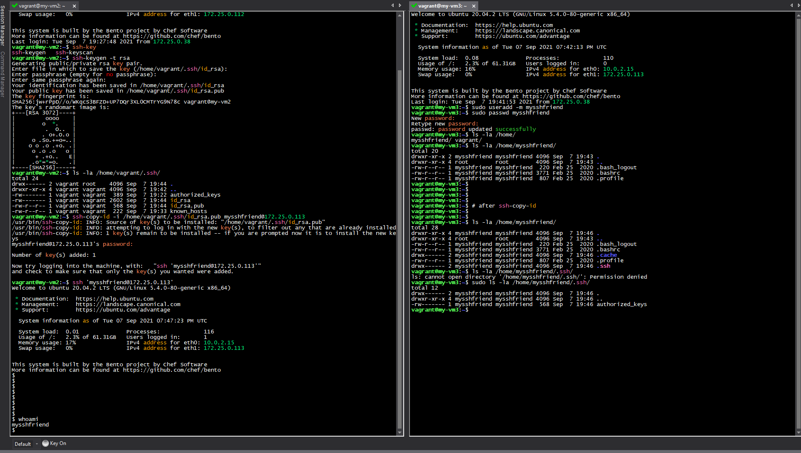

# Step Where
1 Create a new virtual machine (VM) or use existing one local machine

2 Install SSH client (if it’s installed yet) local machine

3 Create private and public key pair local machine

4 Install SSH server package
(if it’s installed yet)
remote server

5 Create mysshfriend user with password remote server

6 Connect to VM as mysshfriend user local machine

7 Add public key to mysshfriend user remote server

8 Connect to VM as mysshfriend user local machine

---

